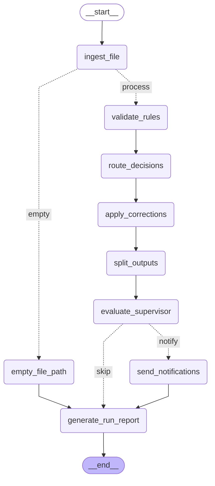

# Enquesta DQ Agent — Graph Topology

This is the LangGraph state machine that orchestrates the data quality
agent. Each node is a module; edges show the flow of execution.
Conditional edges branch on `is_empty` and `should_notify`.

This diagram is generated programmatically from the live graph. Regenerate
with: `python -m src.graph.agent_graph`
